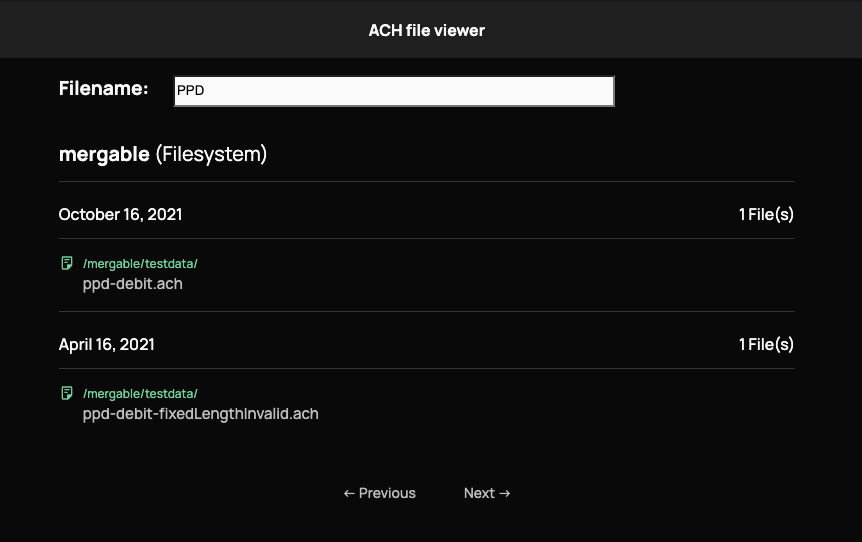

<!--generated-from:a7c0acbe3a7ca9dfc17cce10dbc48b78cf02ef52afa2cc7a8433e5de79e42e08 DO NOT REMOVE, DO UPDATE -->
moov-io/ach-web-viewer
===

ACH Web Viewer is a service that loads and displays lists of ACH Files from various sources on a website.
This allows combining multiple sources of ACH files together for operators to review.

Docs: [docs](https://moov-io.github.io/ach-web-viewer/) | [open api specification](api/api.yml)

## Project Status

This project  is actively used in production environments. Please star the project if you are interested in its progress. We are looking for community feedback so please try out our code or give us feedback!

If you believe you have identified a security vulnerability please responsibly report the issue as via email to security@moov.io. Please do not post it to a public issue tracker.

## Getting Started

Read through the [project docs](docs/README.md) over here to get an understanding of the purpose of this project and how to run it.

## Getting Help

 channel | info
 ------- | -------
 [Project Documentation](docs/README.md) | Our project documentation available online.
Twitter [@moov](https://twitter.com/moov)	| You can follow Moov.io's Twitter feed to get updates on our project(s). You can also tweet us questions or just share blogs or stories.
[GitHub Issue](https://github.com/moov-io/ach-web-viewer/issues) | If you are able to reproduce a problem please open a GitHub Issue under the specific project that caused the error.
[moov-io slack](https://slack.moov.io/) | Join our slack channel (`#ach`) to have an interactive discussion about the development of the project.

## Supported and Tested Platforms

- 64-bit Linux (Ubuntu, Debian), macOS, and Windows

## Contributing

Yes please! Please review our [Contributing guide](CONTRIBUTING.md) and [Code of Conduct](https://github.com/moov-io/ach/blob/master/CODE_OF_CONDUCT.md) to get started! Checkout our [issues for first time contributors](https://github.com/moov-io/ach-web-viewer/contribute) for something to help out with.

This project uses [Go Modules](https://github.com/golang/go/wiki/Modules) and uses Go 1.14 or higher. See [Golang's install instructions](https://golang.org/doc/install) for help setting up Go. You can download the source code and we offer [tagged and released versions](https://github.com/moov-io/ach-web-viewer/releases/latest) as well. We highly recommend you use a tagged release for production.

### Test Coverage

Improving test coverage is a good candidate for new contributors while also allowing the project to move more quickly by reducing regressions issues that might not be caught before a release is pushed out to our users. One great way to improve coverage is by adding edge cases and different inputs to functions (or [contributing and running fuzzers](https://github.com/dvyukov/go-fuzz)).

## License

Apache License 2.0 See [LICENSE](LICENSE) for details.
