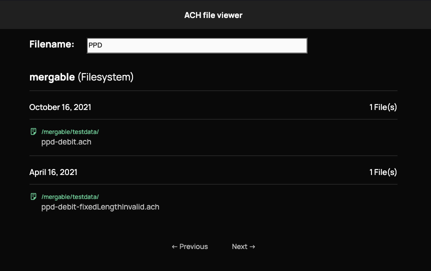
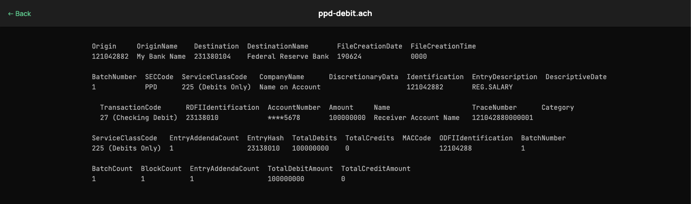
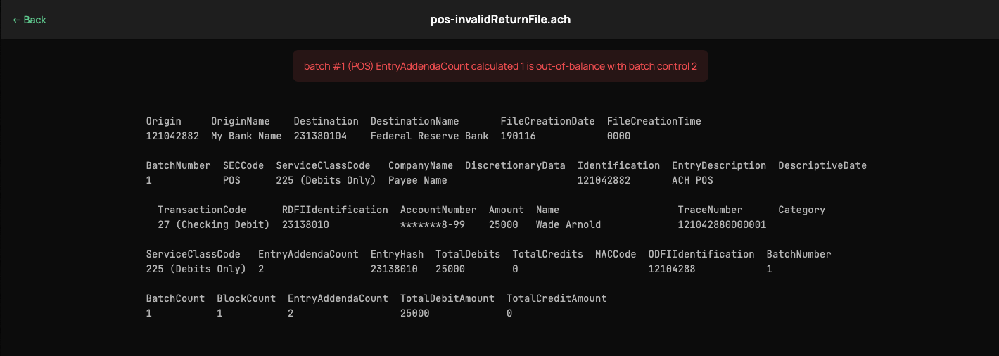

<!-- generated-from:5eaae48b1b4eacced51fe9c8a724bf608d4c39edfb4a2fa3df458b8a7ea5e763 DO NOT REMOVE, DO UPDATE -->
# ACH Web Viewer
**[Purpose](README.md)** | **[Configuration](CONFIGURATION.md)** | **Running**

---

## Running

### Getting Started

More tutorials to come on how to use this as other pieces required to handle authorization are in place!

- [Using docker-compose](#local-development)
- [Using our Docker image](#docker-image)

No configuration is required to serve on `:8200` and metrics at `:8201/metrics` in Prometheus format.

### Docker image

You can download [our docker image `moov/ach-web-viewer`](https://hub.docker.com/r/moov/ach-web-viewer/) from Docker Hub or use this repository.

### Local Development

Run a one-time setup command to install dev dependencies

```
make install
```

(Optional) Update files in `webui/` and re-package them.

```
make update
```

Update code and run the server locally.

```
make run
```

**Suggested** Run the web viewer with an example directory. View [the examples in your browser](http://localhost:8585/ach/?startDate=2020-01-01).

```
APP_CONFIG=./examples/config.yml go run ./cmd/ach-web-viewer
```

## Views

### List all files



### View specific file



### View file with errors


